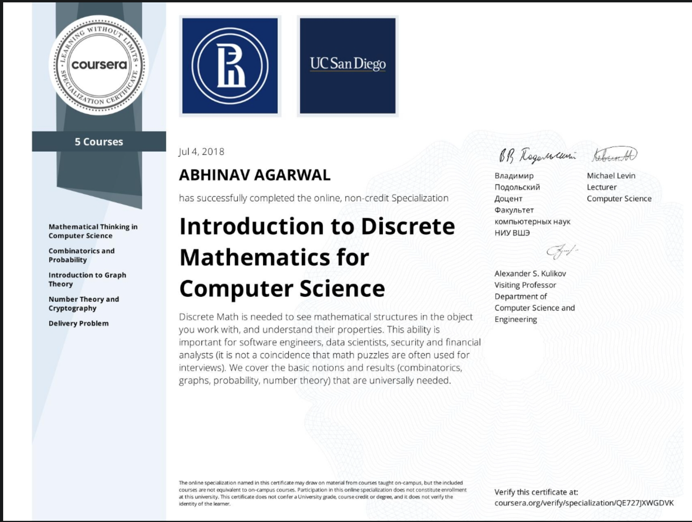

<!--
*** Thanks for checking out the Best-README-Template. If you have a suggestion
*** that would make this better, please fork the repo and create a pull request
*** or simply open an issue with the tag "enhancement".
*** Thanks again! Now go create something AMAZING! :D
-->

<!-- PROJECT SHIELDS -->
<!--
*** I'm using markdown "reference style" links for readability.
*** Reference links are enclosed in brackets [ ] instead of parentheses ( ).
*** See the bottom of this document for the declaration of the reference variables
*** for contributors-url, forks-url, etc. This is an optional, concise syntax you may use.
*** https://www.markdownguide.org/basic-syntax/#reference-style-links
-->
[![Contributors][contributors-shield]][contributors-url]
[![Forks][forks-shield]][forks-url]
[![Stargazers][stars-shield]][stars-url]
[![Issues][issues-shield]][issues-url]
[![MIT License][license-shield]][license-url]
[![LinkedIn][linkedin-shield]][linkedin-url]

<!-- PROJECT LOGO -->
 

  

  <h3 align="center">Introduction to Discrete Mathematics for Computer Science</h3>

  

This repository talks about my learnings through coursework that I completed in Introduction to Discrete Mathematics for Computer Science specialization.
  

  

Introduction to Discrete Mathematics for Computer Science is a beginner level 5 course specialization which introduces the learner to fundamentally important mathematical concepts for computer science including logic, combinatorics, graph theory, cryptography and approximation algorithms.

<!-- GETTING STARTED -->
## List of Courses and Things Learnt

### Course 1. [Mathematical Thinking in Computer Science](https://www.coursera.org/account/accomplishments/certificate/HYX5W3JLQM8D)

*  *Induction, recursion, logic, invariants, examples, optimality*.
* Answering *typical programming questions* like: How can we be certain a *solution exists?*

### Course 2. [Combinatorics and Probability](https://www.coursera.org/account/accomplishments/certificate/G3CJLFVZNWWJ)

* Most standard *combinatorial settings* like permutation and combinations.
* Recursive technique for counting
* Working knowledge and *intuition* of basics of probability

### Course 3. [Introduction to Graph Theory](https://www.coursera.org/account/accomplishments/certificate/GMYHUJ3JHEK3)

* Understanding practical graph systems like *how GPS systems find shortest routes*, *how engineers design integrated circuits*, *how biologists assemble genomes*. 
* *Kruskal algorithm* for finding minimum spanning tree
* David *Gale and Lloyd S. Shapley* algorithms for stable matching.

### Course 4. [Number Theory and Cryptography](https://www.coursera.org/account/accomplishments/certificate/6EWXTKL23GWM)
* *Chinese Remainder Theorem*, *Fast Modular Exponentiation*, *Modular Exponentiation*   
* *Implmentation* of RSA Cryptosystem
* *Weakness and Exploits* in RSA cryptosystem

### Course 5. [Delivery Problem](https://www.coursera.org/account/accomplishments/certificate/C5DEBDGV4RMT)

* Solution to *Traveling Salesman Problem* using: *Cycle Weight*, *Brute Force*, *Average Weight* and *Nearest Neighbors*.
* Exact Algorithms: *Branch and Bound*
* Approximation Algorithms: *2-Approximation"

<!-- MARKDOWN LINKS & IMAGES -->
<!-- https://www.markdownguide.org/basic-syntax/#reference-style-links -->
[contributors-shield]: https://img.shields.io/github/contributors/anshabhi/discrete-maths.svg?style=for-the-badge
[contributors-url]: https://github.com/anshabhi/discrete-maths/graphs/contributors
[forks-shield]: https://img.shields.io/github/forks/anshabhi/discrete-maths.svg?style=for-the-badge
[forks-url]: https://github.com/anshabhi/discrete-maths/network/members
[stars-shield]: https://img.shields.io/github/stars/anshabhi/discrete-maths.svg?style=for-the-badge
[stars-url]: https://github.com/anshabhi/discrete-maths/stargazers
[issues-shield]: https://img.shields.io/github/issues/anshabhi/discrete-maths.svg?style=for-the-badge
[issues-url]: https://github.com/anshabhi/discrete-maths/issues
[license-shield]: https://img.shields.io/github/license/anshabhi/discrete-maths.svg?style=for-the-badge
[license-url]: https://github.com/anshabhi/discrete-maths/blob/master/LICENSE.txt
[linkedin-shield]: https://img.shields.io/badge/-LinkedIn-black.svg?style=for-the-badge&logo=linkedin&colorB=555
[linkedin-url]: https://linkedin.com/in/mrabhinavagarwal

 